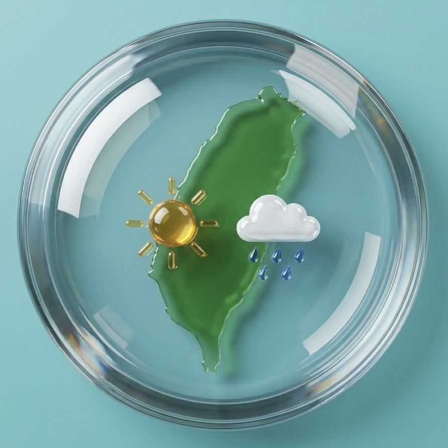

# Taiwan CWA Weather

  

A Home Assistant custom integration for Taiwan Central Weather Administration (中央氣象署, CWA) weather data.  
台灣中央氣象署天氣資料的 Home Assistant 自訂整合。

---

## Why Taiwan CWA? / 為什麼選台灣中央氣象署？

Taiwan is an independent island nation sitting at the intersection of the Pacific Ocean, East China Sea, and South China Sea. Its dramatic terrain — from steep mountain ranges exceeding 3,000m to low-lying coastal plains — combined with seasonal monsoons and typhoon tracks creates one of the most meteorologically complex environments in the world within a relatively small land area. Taiwan's Central Weather Administration (CWA) maintains dedicated forecast infrastructure and observational networks specifically calibrated for these conditions.  
台灣是一個獨立的島國，位處太平洋、東海與南海交界，境內地形從逾3000公尺的高山到低地平原兼具，加上季風與颱風路徑的交互影響，使這片小小的國土擁有全球少見的複雜氣象環境。台灣中央氣象署（CWA）維運專屬預報模型與觀測網路，針對這些在地條件精準調校。

## Taiwan's Rain Probability — What Makes It Different / 台灣降雨機率的特別之處

**CWA's definition (and why it matters):**  
CWA defines "rain probability" as the probability that **precipitation ≥ 0.1mm will occur** at any point in a given area during a 12-hour forecast period. This is fundamentally different from what many international weather apps report.  

**CWA 的定義（為何重要）：**  
中央氣象署的「降雨機率」定義為：預報區域在特定 **12 小時時段內，出現 ≥0.1mm 降水的機率**。這與多數國際天氣 App 的計算方式有本質差異。

Key characteristics / 關鍵特性：
- Reported in **10% increments** (10%, 20% … 90%) — you will never see 37% / 以**十分進位**呈現（10%、20%…90%），不會出現 37% 這種數字
- Does **not** indicate duration, intensity, or spatial coverage of rain / **不代表**下雨時間長短、雨量大小或降雨範圍
- "30% chance of rain" = 30% probability that rain occurs at all, not "rain 30% of the time" / 「降雨機率 30%」= 有下雨這件事發生的機率為 30%，而非「30% 的時間會下雨」
- Covers a **36-hour window** broken into three 12-hour periods / 涵蓋 **36 小時**，分為三個 12 小時時段

**Why different apps show different numbers / 為什麼不同 App 數字差很多：**
1. **Different models** — CWA uses proprietary statistical models + WRF; international apps use ECMWF, GFS, or Dark Sky nowcasting / 模型不同：CWA 用自家統計＋WRF；國際 App 用 ECMWF、GFS 等
2. **Different definitions** — some apps report "probability of rain in any given hour," others report "probability at a specific point" / 定義不同：有些算每小時任一點的機率，有些算特定地點的機率
3. **Nowcasting vs. probabilistic forecast** — radar extrapolation (0–2 hr) and probabilistic models are completely different techniques / 雷達外推（0–2 小時）與機率預報是完全不同的技術

> **For Taiwanese users, CWA's probability is the standard reference because it is calculated specifically for Taiwan's geography and aligns with how rain probability is communicated in local media and daily life.**  
> **對台灣用戶而言，CWA 的降雨機率是標準參考值，因為它針對台灣地理條件計算，也與本地媒體及日常生活慣用的表達方式一致。**

Reference: [CWA QPF documentation](https://www.cwa.gov.tw/V8/C/P/QPF.html) · [Meteorological verification metrics](https://nhess.copernicus.org/articles/22/23/2022/)

---

## Features / 功能

- Current weather condition / 目前天氣狀況（例：陰短暫陣雨）
- Rain probability / 降雨機率（%）
- Max temperature / 最高溫（°C）
- Min temperature / 最低溫（°C）
- Configurable update interval / 可自訂更新頻率
- Supports all 22 cities/counties in Taiwan / 支援台灣全部 22 縣市

---

## Installation via HACS / 透過 HACS 安裝

### One-click / 一鍵安裝

Click the button below to open HACS and add this repository automatically.  
點擊下方按鈕，HA 會自動打開 HACS 安裝對話框。

### Manual HACS / 手動 HACS

1. Open HACS → Integrations / 開啟 HACS → 整合
2. Click the three-dot menu → Custom Repositories / 點選右上角三點選單 → 自訂存放庫
3. Enter URL: `https://github.com/puyanlin/Taiwan-CWA-Weather` / 輸入上方網址
4. Category: Integration / 類別選「整合」
5. Click Add, then find and download "Taiwan CWA Weather" / 點新增，找到後下載
6. Restart Home Assistant / 重啟 Home Assistant

### Manual / 手動安裝

Copy `custom_components/taiwan_cwa/` to your HA `config/custom_components/` folder, then restart.  
將 `custom_components/taiwan_cwa/` 複製到 HA 的 `config/custom_components/` 後重啟。

---

## Configuration / 設定

After installation, go to **Settings → Integrations → Add Integration** and search for **Taiwan CWA Weather**.  
安裝後前往 **設定 → 整合 → 新增整合**，搜尋 **Taiwan CWA Weather**。

You will need: / 需要填入：
- **CWA API Key** — Get it free at [opendata.cwa.gov.tw](https://opendata.cwa.gov.tw/) / 免費申請
- **City / 城市** — Select from dropdown (22 options) / 從下拉選單選擇（22 縣市）
- **Update interval / 更新間隔** — Default 3600 seconds / 預設 3600 秒

---

## Sensors / 感應器

| Entity ID | Description | 說明 |
|---|---|---|
| `sensor.taiwan_cwa_weather` | Weather condition | 天氣狀況 |
| `sensor.taiwan_cwa_rain_prob` | Rain probability (%) | 降雨機率 |
| `sensor.taiwan_cwa_max_temp` | Max temperature (°C) | 最高溫 |
| `sensor.taiwan_cwa_min_temp` | Min temperature (°C) | 最低溫 |

---

## Supported Cities / 支援縣市

臺北市、新北市、桃園市、臺中市、臺南市、高雄市、基隆市、新竹市、新竹縣、苗栗縣、彰化縣、南投縣、雲林縣、嘉義市、嘉義縣、屏東縣、宜蘭縣、花蓮縣、臺東縣、澎湖縣、金門縣、連江縣

---

## Notes / 注意事項

- CWA's SSL certificate is missing the Subject Key Identifier extension. This integration disables SSL verification for the CWA API endpoint only.  
  CWA 官方 API 的 SSL 憑證缺少 Subject Key Identifier，本整合僅針對該 API 停用 SSL 驗證。
- Data is sourced from the F-C0032-001 dataset (36-hour forecast).  
  資料來源為 F-C0032-001（36小時預報）。

---

## Support / 支持

If this integration is useful for your Home Assistant setup, consider buying me a coffee — it keeps the updates coming.  
如果這個整合對你的 Home Assistant 有幫助，歡迎請我喝杯咖啡，讓更新持續下去。

  

